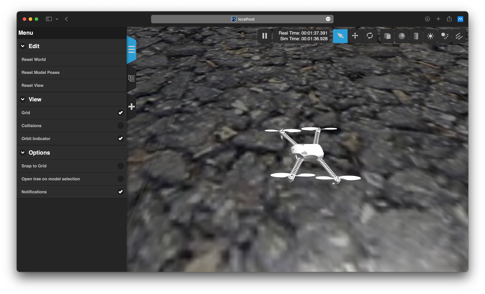

# Docker Environment for PX4 Development with ROS2 Foxy and Gazebo Web Simulation (gzweb)

This repository contains a Dockerfile to build a Docker image for PX4 development with ROS2 Foxy and Gazebo Web Simulation (gzweb). This docker image can be used to run the PX4 SITL simulation on headless infrastructure. The Gazebo client is served via a web browser.



## Prerequisites

- Git
- Docker

## Build the Docker Image

Clone this repository and build the Docker image:

```bash
git clone https://github.com/joshuadamanik/px4_gzweb.git --recursive
cd px4_gzweb
docker build -t px4_gzweb:latest Dockerfile-<arch>
docker run -it --rm --name px4_gzweb
    -v src/PX4-Autopilot:/root/PX4-Autopilot
    -v src/ws_commander:/root/ws_commander
    -p 8080:8080
    -p 14570:14570/udp
    px4_gzweb:latest bash
```

Or pull the Docker image from Docker Hub:

```bash
docker run -it --rm --name px4_gzweb
    -v src/PX4-Autopilot:/root/PX4-Autopilot
    -v src/ws_commander:/root/ws_commander
    -p 8080:8080
    -p 14570:14570/udp
    joshuajdmk/px4_gzweb:<arch> bash
```

where `<arch>` is the architecture of your host machine. The following architectures are supported:
- `amd64` (x86_64)  : Linux, Windows
- `arm64` (ARMv8) : macOS

## Run the PX4 SITL Simulation

Attach two terminals to the Docker container.

Terminal 1:
```bash
cd /root/PX4_Autopilot
HEADLESS=1 make px4_sitl gazebo-classic
```

Terminal 2:
```bash
cd /root/gzweb
npm start
```

Open a web browser and navigate to `http://localhost:8080/`. You should see the Gazebo client.

## Build and Run the ROS2 Commander

Attach another two terminals to the Docker container.

Terminal 3:
```bash
MicroXRCEAgent udp4 -p 8888
```

Terminal 4:
```bash
cd /root/ws_commander
source /opt/ros/foxy/setup.bash
colcon build
source install/setup.bash
ros2 launch px4_ros_com offboard_control.launch.yaml
```

## License

This repository is licensed under the BSD 3-Clause License. See [LICENSE](LICENSE) for more information.